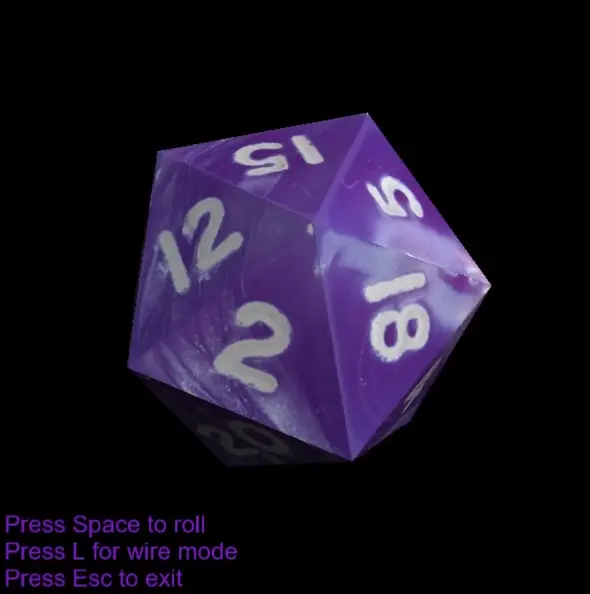

# Roll a D20


Try your luck and roll a D20. Be amused by simple but charming animation revealing the enchanted facets of the icosahedron.

## Requirements
- OpenGL 4.5 compatible GPU

## Build
0. For Linux, install GLFW dependencies, see https://www.glfw.org/docs/3.3/compile_guide.html#compile_deps.
1. Clone repository with submodules (`--recursive`)
2. Go to project directory
```
cd opengl_d20
```
3. Build with CMake:
 ```
mkdir build
cd build
cmake ..
cmake --build .
 ```
