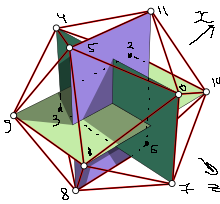

# Roll a D20

## Build
1. Clone repository with submodules (`--recursive`)
2. Go to project directory
```
cd opengl_d20
```
3. Build with CMake:
 ```
mkdir build
cd build
cmake ..
cmake --build .
 ```
